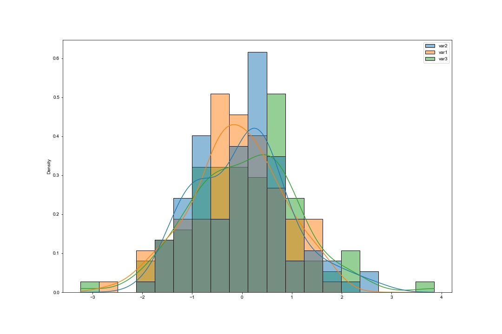
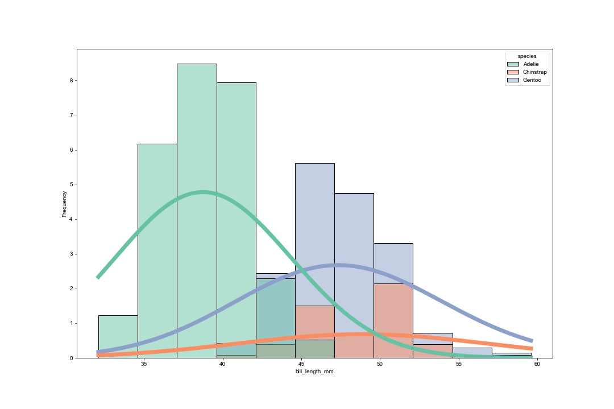
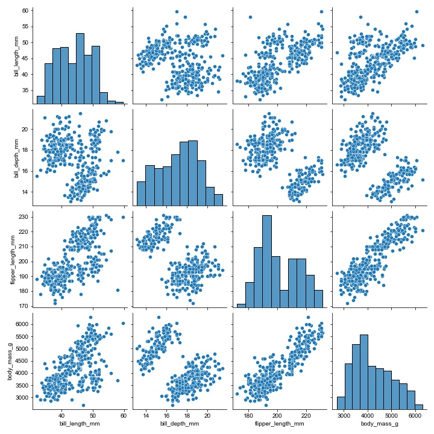

<h1> In this Jupyter Notebook, we have covered the following plots:- </h1>

- Distribution Plots
- - Histogram Plot
- - Kernel Density Plot
- - Rugplot
- Categorical Plots
- - Swarmplot
- - Violinplot
- - Point Plot
- Regression Plot
- Heatmap
- Cluster Heatmap
- Pairplot
- Jointplot

    

